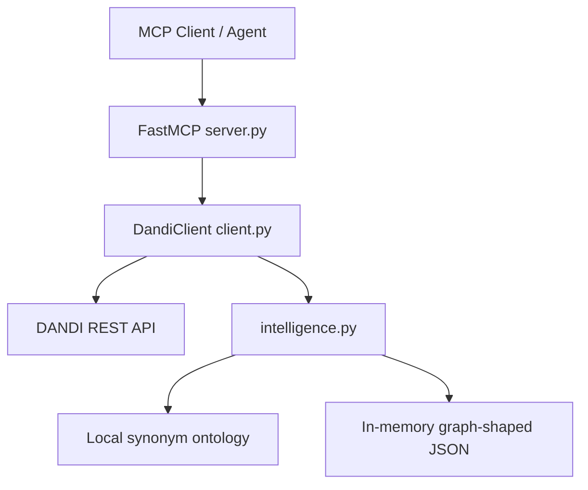
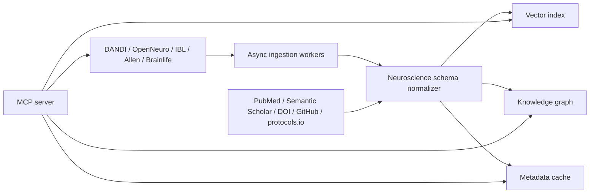

# Architecture Audit

This project is evolving from a DANDI API wrapper into a neuroscience data operating layer for AI agents. The current codebase is intentionally small, so the audit is blunt: before the intelligence layer was added, the system had no persistent index, no ontology service, no vector search, no NWB parser, no paper API integration, no knowledge graph store, no async transport layer, and no cross-repository abstraction.

## Current Architecture

The runtime entry point is `dandi_mcp.server:main`, which builds a `FastMCP` server and registers tools, resources, and prompts. The server delegates all archive communication to `DandiClient`, a synchronous `httpx.Client` wrapper around the DANDI REST API. The new `dandi_mcp.intelligence` module adds deterministic metadata intelligence: ontology keyword extraction, lexical semantic ranking, paper identifier extraction, NWB path summaries, and graph-shaped outputs.

## Dependency Graph

The production dependency graph is deliberately light: `mcp[cli]` provides the MCP server runtime, and `httpx` provides HTTP access to DANDI. Development adds `pytest`, `mkdocs`, and `mkdocs-material`. There is not yet a vector database, embedding provider, NWB reader, RDF/graph database, PubMed client, Semantic Scholar client, cache, queue, or observability backend.

## Feature Inventory

Implemented DANDI coverage includes public Dandiset search, version metadata, asset listing, asset path browsing, asset metadata, download redirects, archive info/stats, schema lookup, users, Zarr archive listing, guarded mutating endpoints, and a universal `call_dandi_api` fallback. Implemented AI-agent affordances include `summarize_dandiset`, `search_datasets`, `semantic_search_dandisets`, `analyze_dandiset_neuroscience`, `get_related_papers`, `find_similar_datasets`, `find_behavioral_paradigms`, `get_dandiset_knowledge_graph`, and `query_knowledge_graph`.

## Missing Capability Report

The biggest missing capability is corpus-scale semantic retrieval. The current semantic search performs DANDI keyword retrieval and then local lexical/ontology reranking over one candidate page. This is useful as a baseline but is not a substitute for an embedding pipeline over all Dandisets, assets, papers, labs, brain regions, and behavioral paradigms.

The second major gap is real NWB understanding. The system infers NWB structure from asset paths and DANDI metadata, but it does not download or stream NWB/Zarr files, inspect `NWBFile` objects, parse trials tables, units, devices, electrodes, imaging planes, optogenetic stimulation, behavioral events, or processing modules.

The third gap is literature infrastructure. DOI, PubMed, Semantic Scholar, GitHub, protocols.io, and related-resource links can now be extracted from metadata, but the server does not yet resolve them through external APIs, build citation graphs, fetch abstracts, connect authors/labs/institutions, or infer dataset-paper-code-protocol provenance.

The fourth gap is knowledge graph persistence. The current graph output is in-memory JSON for one Dandiset. A production system needs durable graph storage, normalized identifiers, ontology-backed entity resolution, provenance on every edge, confidence scoring, and graph queries across archives.

The fifth gap is interoperability. The current client is DANDI-specific. A neuroscience operating layer should define provider interfaces for DANDI, OpenNeuro, IBL, Allen Brain Atlas, Brainlife, DataLad, and local NWB/BIDS stores, with shared dataset, subject, session, modality, paper, and pipeline schemas.

## Prioritized Roadmap

| Priority | Capability | Why it matters | Complexity |
|---:|---|---|---|
| 1 | Persistent embedding index | Enables real semantic search, similar datasets, recommendations, and agent retrieval over the full corpus. | High |
| 2 | NWB/Zarr metadata parser | Extracts trials, units, devices, electrodes, imaging planes, behavior events, and processing modules. | High |
| 3 | Literature API linkage | Connects Dandisets to papers, authors, code, protocols, citations, and reuse context. | Medium |
| 4 | Provider abstraction | Allows OpenNeuro, IBL, Allen, Brainlife, and local archives to share one MCP vocabulary. | Medium |
| 5 | Knowledge graph store | Supports graph traversal across datasets, papers, labs, species, modalities, regions, and pipelines. | High |
| 6 | Async client and caching | Improves throughput, latency, rate-limit behavior, and large-corpus ingestion. | Medium |
| 7 | Observability and provenance | Makes agent outputs auditable and scientifically trustworthy. | Medium |

## Production Architecture Target

The target system should split ingestion, indexing, graph, and serving. Ingestion workers crawl archive APIs and selected metadata files. A metadata normalizer maps provider-specific fields into shared neuroscience schemas. An embedding pipeline writes vectors to a vector index. A graph builder writes normalized entities and relationships to a graph store. The MCP server becomes a low-latency agent interface over those indexes while still exposing provider-native escape hatches.

## Example Agent Queries

An agent should be able to ask: "Find mouse Neuropixels datasets with visual decision-making and licking behavior"; "Compare hippocampal navigation paradigms across rat and mouse datasets"; "Which Dandisets have NWB trials tables and optogenetic stimulation?"; "Find datasets similar to DANDI:000XXX but with calcium imaging"; and "Show the paper, code, protocol, species, modality, and brain-region graph for this Dandiset."

## Scaling Recommendations

Use async HTTP ingestion with bounded concurrency and archive-aware rate limits. Store raw provider responses separately from normalized records. Version every normalization pass. Add deterministic provenance to every extracted field and graph edge. Use an embedding model suitable for biomedical/scientific text, then index dataset-level, asset-level, paper-level, and protocol-level chunks separately. Keep MCP tools high-level and agent-first, but preserve provider-native tools for escape hatches.

## Ecosystem Roadmap

OpenNeuro support should add BIDS dataset indexing, task/event extraction, participant/session parsing, and NIfTI/BIDS metadata summaries. IBL support should add Alyx/ONE integration, behavior trials, probes, subjects, sessions, and analysis-ready tables. Allen Brain Atlas support should add anatomy, cell types, connectivity, electrophysiology, visual coding, and ontology-backed brain regions. Brainlife support should add pipeline/app provenance, derivatives, and workflow composition. NWB ecosystem integration should add PyNWB/NWBInspector, HDMF/Zarr streaming, trials/unit/device extraction, and validation summaries.
